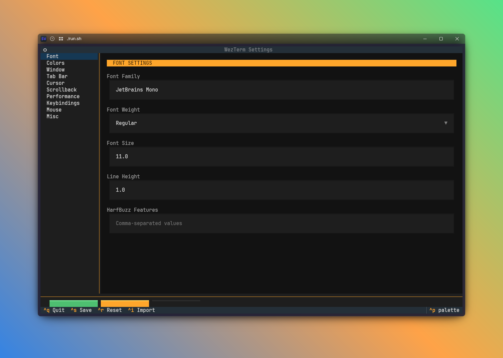

# wezterm-tui

A terminal UI for managing [WezTerm](https://wezfurlong.org/wezterm/) settings. Configure fonts, colors, keybindings, and more without manually editing Lua files.




## Features

- **10 settings categories** -- font, colors, window, tabs, cursor, scrollback, performance, keybindings, mouse, miscellaneous
- **Color scheme browser** -- searchable selector with live preview showing ANSI swatches, bright colors, and a sample prompt
- **Live palette extraction** -- pulls all color schemes directly from the WezTerm binary; falls back to 217 bundled schemes when WezTerm is unavailable
- **Keybindings editor** -- table-based UI for adding, editing, and deleting key mappings with 16+ WezTerm actions
- **Import existing config** -- reads your current `wezterm.lua` and imports settings
- **Lua generation** -- saves a clean, commented `settings.lua` you can `require()` from your config
- **Validation** -- type checking, range constraints, and enum validation on all 42 settings
- **Live preview** -- bottom-panel terminal mock that updates in real-time as you tweak font, colors, cursor, and window settings
- **Undo/redo** -- track changes and revert with `Ctrl+Z` / `Ctrl+Y`
- **Settings profiles** -- save and load named configurations with `Ctrl+P`
- **Diff view** -- review pending changes before saving with `Ctrl+D`
- **Export/share** -- export settings as Lua, JSON, or base64 with `Ctrl+E`
- **Safe saves** -- atomic writes with `.json.bak` backup before each save
- **Settings sanitization** -- invalid or missing values are auto-corrected to defaults on load

## Install

```bash
curl -sS https://raw.githubusercontent.com/DarkoKuzmanovic/wezterm-tui/master/install.sh | sh
```

Requires Python 3.12+. The installer uses [uv](https://docs.astral.sh/uv/), [pipx](https://pipx.pypa.io/), or pip (in that order of preference).

## Quick Start

```bash
git clone https://github.com/DarkoKuzmanovic/wezterm-tui.git
cd wezterm-tui
./run.sh
```

The `run.sh` script creates a virtual environment, installs dependencies, and launches the app automatically.

### Install For Development

If you are working on the project and do not need a global command, use the local virtual environment:

```bash
python3 -m venv .venv
source .venv/bin/activate
pip install -e .
wezterm-tui
```

### Install As A Global Command

If you want to run `wezterm-tui` from any directory in your terminal, install the console script into your user environment.

With [uv](https://docs.astral.sh/uv/):

```bash
cd ~/source/wezterm-tui
uv tool install --editable .
wezterm-tui
```

With `pip`:

```bash
cd ~/source/wezterm-tui
python3 -m pip install --user -e .
wezterm-tui
```

Make sure `~/.local/bin` is in your `PATH`.

### Run Without Installing

```bash
uv run wezterm-tui
```

## Usage

Navigate categories with the sidebar. Edit settings in the main panel.

In Colors, move through the scheme list to preview a theme before selecting it.

| Shortcut | Action                    |
| -------- | ------------------------- |
| `Ctrl+S` | Save settings             |
| `Ctrl+R` | Reset to last save        |
| `Ctrl+I` | Import from `wezterm.lua` |
| `Ctrl+D` | View pending changes diff |
| `Ctrl+Z` | Undo                      |
| `Ctrl+Y` | Redo                      |
| `Ctrl+P` | Load/save profiles        |
| `Ctrl+E` | Export settings            |
| `Ctrl+Q` | Quit                      |

### Where settings are stored

Settings are saved to `~/.config/wezterm/`:

- `settings.json` -- your settings (read/written by the app)
- `settings.lua` -- generated Lua config

To use the generated config, add this to your `wezterm.lua`:

```lua
local settings = require("settings")
for k, v in pairs(settings) do
    config[k] = v
end
```

## Development

```bash
pip install -e ".[dev]"
pytest
```

## License

MIT
